# Full pipeline — Dual-Decoder Temporal BORA-Fuse

Tài liệu này mô tả đúng đường thực thi bắt đầu từ `main.py` với cấu hình hiện tại trong
`config/train_config.json`. Các script trong `scripts/` không thuộc pipeline dưới đây.

> **Kiến trúc đang thực sự được chạy:** PANNs CNN6 cho audio + EfficientNet-B0 cho từng
> video frame + Temporal BORA-Fuse + hai decoder Ordinal/ Nominal.
>
> `main.py` không đọc `config/train_config.temporal_bora.json`. File đó dùng `SwinTiny`,
> còn config được `main.py` đọc hiện dùng `EfficientNetB0`.

## Pipeline methodology cho paper — đọc từ trái sang phải

Sơ đồ chính dưới đây nối đủ hai encoder, temporal evidence, classifier reuse,
boundary fusion, global bypass, hai decoder và output. Các module được phóng chi
tiết trong bản ghép (a–d); objective và công thức chính xác nằm trong tài liệu
methodology riêng.

[Methodology + caption tiếng Anh + công thức đối chiếu code](paper_methodology.md) ·
[Hình chính SVG](diagrams/paper_methodology_overview.svg) ·
[Bản đầy đủ (a–d) SVG](diagrams/paper_methodology.svg) ·
[PNG độ phân giải cao](diagrams/paper_methodology.png)


Bản sơ đồ dọc trước đây vẫn được giữ để tham khảo từng bước:
[SVG](diagrams/full_model_pipeline.svg) · [PNG](diagrams/full_model_pipeline.png).

### Cách đọc các đường truyền

- Audio và video ở bên trái; ordinal và nominal decoder ở bên phải.
- `a` đi vào temporal module, fusion và global bypass. `V` đi vào fusion và phép
  mean để tạo `g`; `g` đi vào auxiliary video head và nominal decoder.
- Đường hồng mang classifier logits/conditional logits trong forward, không phải
  loss. `C_a/C_v` đi vào cả auxiliary heads và fused ordinal logits.
- Chấm tròn là nhánh rẽ; đường giao nhau không có chấm không nối tensor. Loss được
  giải thích riêng, label không phải input của model khi dự đoán.
- `B` là batch size; `k=0,1,2` là ba conditional tasks; `T=8`, `D=256`.

### Các điểm cần giữ đúng khi sử dụng sơ đồ

1. Audio được tổng hợp thành vector toàn clip. Transformer xử lý chuỗi **video**, rồi
   audio hướng dẫn việc chọn bằng chứng theo thời gian.
2. Motion được tính từ **projected frame features**, sau projection có dropout;
   đây là độ thay đổi đặc trưng, không phải optical flow.
3. `video_global` là trung bình của **ba boundary features**, sau temporal attention.
4. Auxiliary video ordinal head nhận `video_global`; video reliability head nhận từng
   `V[k]`. Hai head này có đầu vào khác nhau.
5. Teacher logits được lấy từ classifier của chính encoder đang fine-tune. Video
   teacher residual dùng `mean(softmax(frame_logits))`; preservation loss dùng
   `CE(mean(frame_logits), label)`.
6. Nominal head nhận `[mean(I_0,I_1,I_2), a, video_global]` có **768 chiều**.
   Teacher residual được cộng vào ordinal logits, sau khi lấy interaction features cho
   nominal head.
7. `clipwise_output` là **log-probability cuối** theo thứ tự dataset. Tensor
   `rank_probabilities` vẫn là xác suất ordinal trước nominal correction.

Nguồn đối chiếu chính: [`forward()` của multimodal wrapper](../models/multimodal_model.py),
[`TemporalBORAFusion.forward()`](../models/fusion/fusion_heads.py),
[`bora_loss()`](../utils/ordinal.py) và [`MultimodalTrainer`](../tasks/trainer.py).

Sơ đồ được xuất thành SVG có thể phóng to và PNG 1600 × 5472 px. Để tái tạo hai hình:

```bash
python docs/diagrams/render_pipeline.py
```


## 1. Cấu hình quyết định kiến trúc

| Thành phần | Giá trị hiện tại |
|---|---:|
| Số lớp | 4 |
| Thứ tự label dataset | `none=0, strong=1, medium=2, weak=3` |
| Thứ tự ordinal | `none=0, weak=1, medium=2, strong=3` |
| Audio | 2 giây, 64 kHz, 128.000 samples |
| Audio encoder | PANNs CNN6 |
| Video | 8 RGB frames, `224 x 224` |
| Video encoder | EfficientNet-B0 chạy độc lập trên từng frame |
| Fusion dimension | 256 |
| Temporal encoder | 2 Transformer layers, 4 heads |
| Fusion type | `temporal_bora_fusion` |
| Batch size | 32 |
| Optimizer | Adam |
| Learning rate fusion head | `1e-4` |
| Learning rate encoder | `1e-5` (`encoder_lr_scale=0.1`) |

## 2. Pipeline thực thi từ `main.py`

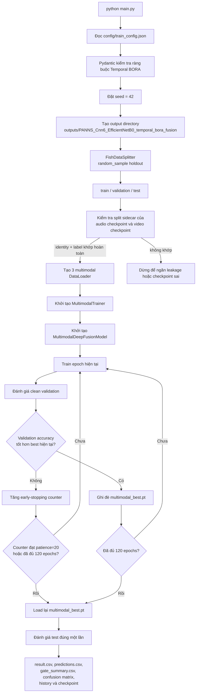

## 3. Tạo một multimodal sample

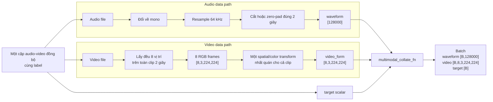

Ở train split, video clip có thể được lật ngang và đổi brightness. Một phép biến đổi duy
nhất được áp dụng cho tất cả frame trong clip để không tạo chuyển động giả giữa các frame.
Validation và test chỉ resize/chuyển tensor/chuẩn hóa ImageNet.

## 4. Forward pass tổng thể

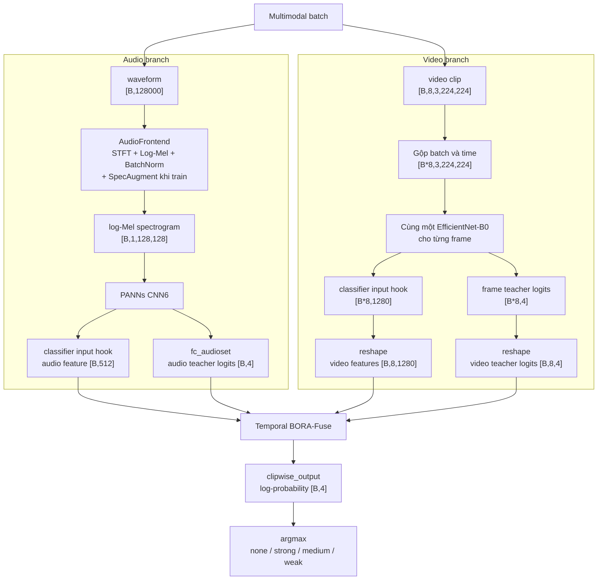

Hai classifier đơn phương thức không bị bỏ đi. Input của classifier được lấy làm feature,
còn output classifier được giữ làm teacher logits cho teacher residual và preservation loss.
Các teacher này tiếp tục được fine-tune; chúng không phải teacher frozen.

## 5. Audio encoder chi tiết


Max pooling giữ sự kiện âm thanh nổi bật; mean pooling giữ mức hoạt động kéo dài. Tổng của
hai pooling cung cấp cả bằng chứng cục bộ mạnh và thống kê toàn clip.

## 6. Video encoder chi tiết

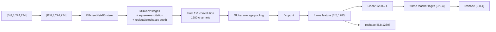

EfficientNet chỉ học đặc trưng không gian trong từng frame. Quan hệ thời gian được học sau
khi mỗi frame đã được nén thành vector 1280 chiều.

## 7. Temporal BORA-Fuse chi tiết

### 7.1 Projection, motion và temporal context

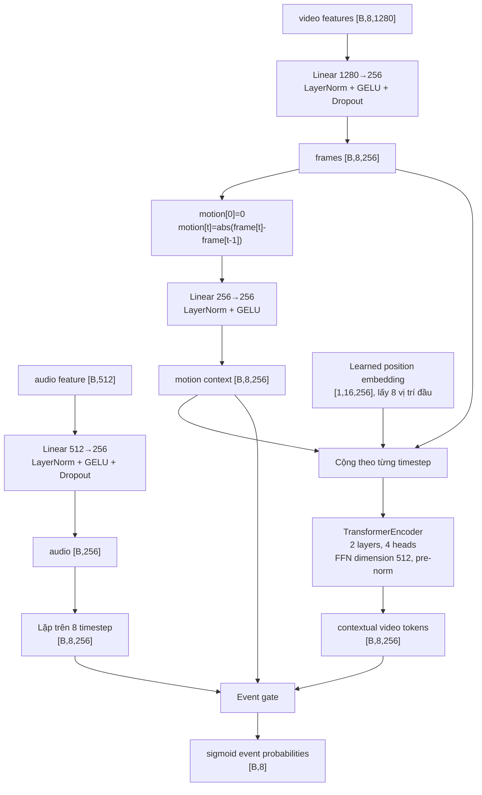

Event gate nhận phép nối `[temporal token, global audio, motion context]` có shape
`[B,8,768]`, rồi sinh một xác suất sự kiện cho mỗi frame. Audio ở đây là thông tin global
cho cả clip, không phải một chuỗi audio token theo thời gian.

### 7.2 Ba boundary-conditioned temporal attention

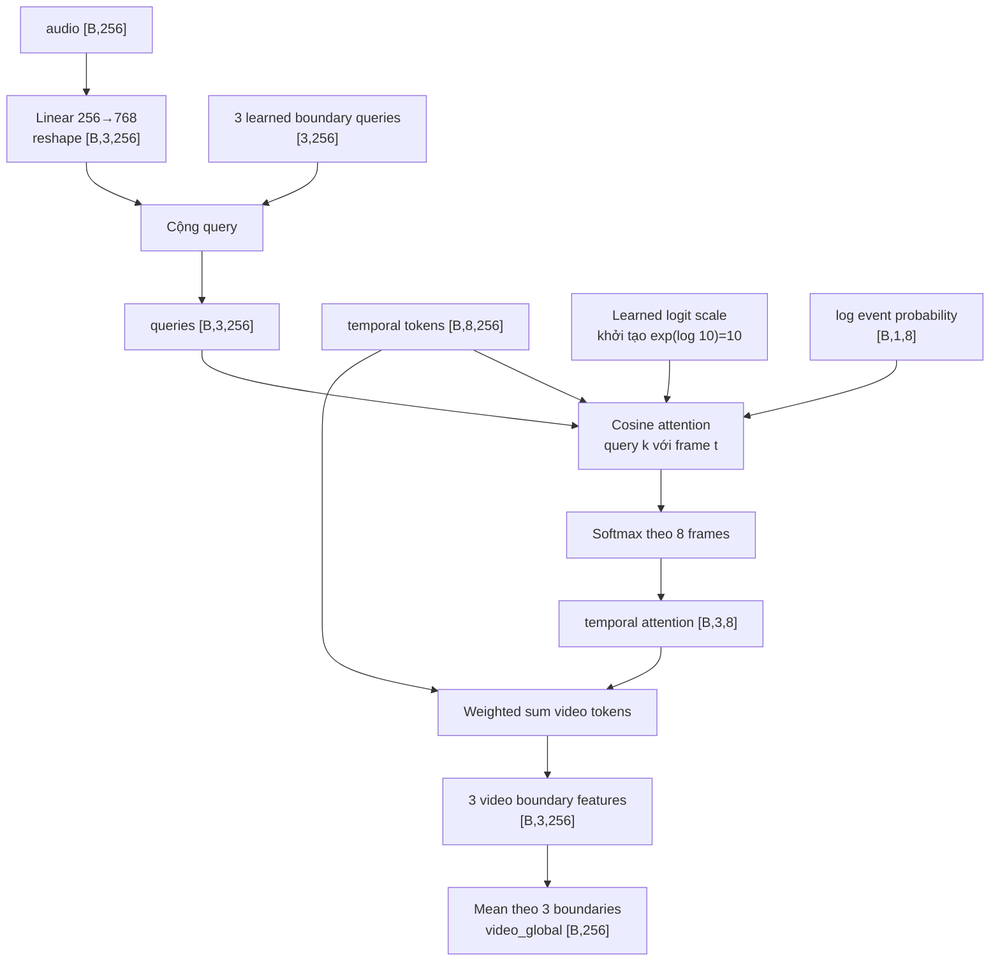

Ba query tương ứng ba quyết định ordinal:

1. `none` so với `weak+`;
2. `weak-` so với `medium+`;
3. `medium-` so với `strong`.

Vì bằng chứng cho mỗi ranh giới có thể xuất hiện ở frame khác nhau, mỗi boundary có một
phân phối attention riêng thay vì dùng một video vector chung.

### 7.3 Auxiliary ordinal heads, teacher residual và reliability

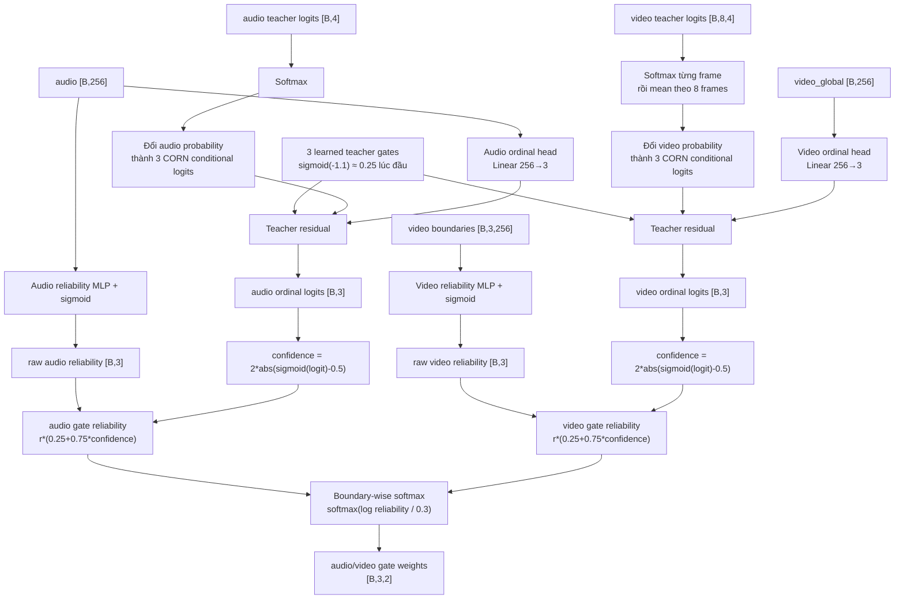

Trong epoch 0, 1 và 2, `set_epoch()` bật warm-up và thay toàn bộ gate bằng `[0.5, 0.5]`.
Từ epoch 3, gate mới sử dụng reliability học được. Confidence calibration ngăn một
reliability MLP bị bão hòa gần 1 thống trị fusion dù auxiliary decision đang không chắc chắn.

### 7.4 Fusion riêng cho từng boundary

Quy trình sau được lặp độc lập cho `k = 0, 1, 2`:

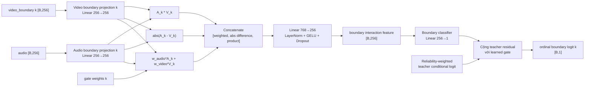

- Weighted feature mang thông tin đã cân bằng theo độ tin cậy.
- Absolute difference biểu diễn mức bất đồng giữa hai modality.
- Element-wise product biểu diễn mức đồng thuận/tương tác.

Ghép ba scalar boundary logits tạo `ordinal_logits [B,3]`.

## 8. Dual decoder và output cuối

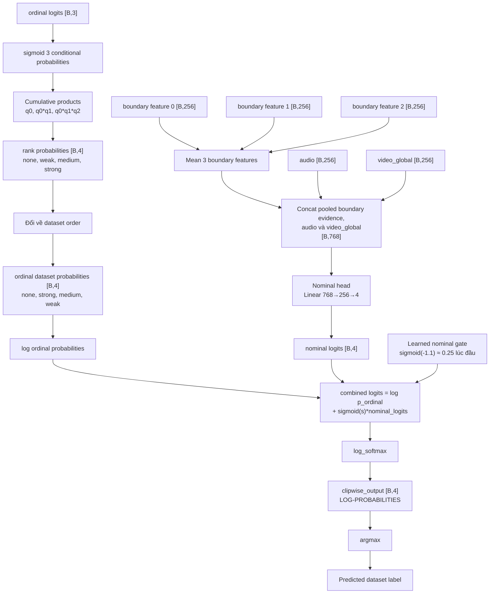

### CORN probability

Với `q0`, `q1`, `q2` là ba conditional probabilities:

```text
P(rank=0) = 1 - q0
P(rank=1) = q0 - q0*q1
P(rank=2) = q0*q1 - q0*q1*q2
P(rank=3) = q0*q1*q2
```

Ordinal decoder giữ cấu trúc thứ tự và giảm lỗi xa. Nominal decoder nhìn đồng thời cả ba
boundary evidence để sửa lỗi exact-class, nhất là các cặp kề nhau. Learned coupling tương
đương với việc hiệu chỉnh `p_ordinal` bằng bằng chứng nominal trong logit space.

## 9. Nhánh motion auxiliary

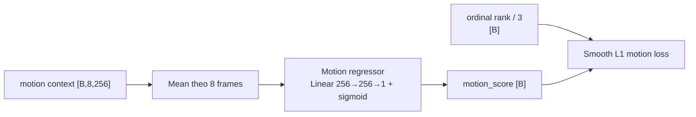

Nhánh này ép temporal representation giữ thông tin liên quan đến mức chuyển động và cường
độ ăn. Nó là auxiliary output, không trực tiếp được dùng để chọn class ở inference.

## 10. Training-only corruption

Trước forward pass, mỗi training sample chọn đúng một trong ba trạng thái loại trừ nhau:

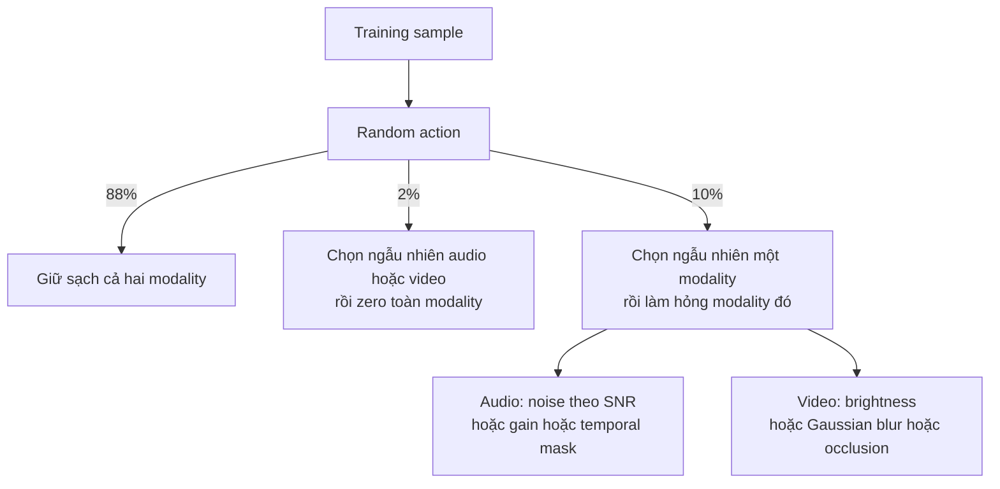

Tính theo toàn bộ batch, kỳ vọng là 1% audio dropout, 1% video dropout, 5% audio corruption,
5% video corruption và 88% clean. Mục đích là dạy reliability head phản ứng với modality
kém chất lượng thay vì luôn dự đoán cả hai đều đáng tin.

## 11. Toàn bộ loss graph

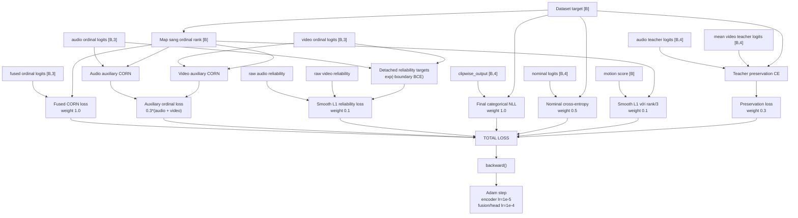

Loss tổng:

```text
L = L_fused_CORN
  + 0.3 * (L_audio_CORN + L_video_CORN)
  + 0.1 * L_reliability
  + 1.0 * L_final_categorical
  + 0.1 * L_motion
  + 0.5 * L_nominal
  + 0.3 * L_teacher_preservation
```

## 12. Tensor shape ledger

| Stage | Tensor shape |
|---|---:|
| Raw audio batch | `[B,128000]` |
| STFT | `[B,1,126,1025]` |
| Padded log-Mel | `[B,1,128,128]` |
| Audio embedding | `[B,512]` |
| Audio teacher logits | `[B,4]` |
| Raw video batch | `[B,8,3,224,224]` |
| Flattened frame batch | `[B*8,3,224,224]` |
| EfficientNet frame embedding | `[B*8,1280]` |
| Video embeddings | `[B,8,1280]` |
| Video teacher logits | `[B,8,4]` |
| Projected audio | `[B,256]` |
| Projected video frames | `[B,8,256]` |
| Motion context | `[B,8,256]` |
| Temporal tokens | `[B,8,256]` |
| Event probabilities | `[B,8]` |
| Boundary queries | `[B,3,256]` |
| Temporal attention | `[B,3,8]` |
| Video boundary features | `[B,3,256]` |
| Audio/video reliability | `[B,3]` mỗi modality |
| Audio/video gate weights | `[B,3]` mỗi modality |
| Boundary interaction features | ba tensor `[B,256]` |
| Ordinal logits | `[B,3]` |
| Rank probabilities | `[B,4]` |
| Nominal logits | `[B,4]` |
| Motion score | `[B]` |
| Final `clipwise_output` | `[B,4]` log-probabilities |

## 13. Output dictionary

| Key | Vai trò |
|---|---|
| `clipwise_output` | Log-probability cuối theo dataset order; dùng để tính NLL và `argmax` |
| `rank_probabilities` | Probability thuần ordinal theo rank order |
| `ordinal_logits` | Ba fused CORN conditional logits |
| `audio_ordinal_logits` | Auxiliary audio CORN logits |
| `video_ordinal_logits` | Auxiliary video CORN logits |
| `audio_reliability`, `video_reliability` | Reliability thô dùng trong reliability loss |
| `audio_gate_reliability`, `video_gate_reliability` | Reliability đã hiệu chỉnh bằng confidence |
| `audio_gate_weights`, `video_gate_weights` | Trọng số fusion cho từng boundary |
| `temporal_attention` | Phân phối attention trên 8 frame cho từng boundary |
| `event_probabilities` | Xác suất frame chứa sự kiện hữu ích |
| `motion_score` | Dự đoán normalized intensity từ motion context |
| `nominal_logits` | Raw output của exact-class decoder |
| `teacher_residual_scales` | Ba gate điều khiển teacher residual |
| `nominal_residual_gate` | Gate coupling nominal decoder vào output cuối |
| `audio_teacher_logits` | Classifier logits của audio branch |
| `video_teacher_logits_mean` | Trung bình frame logits của video branch |
| `audio_features` | PANNs feature `[B,512]` |
| `video_features` | EfficientNet features `[B,8,1280]` |

`rank_probabilities` phản ánh ordinal decoder trước nominal correction. Vì prediction cuối lấy
từ `clipwise_output`, argmax của hai tensor này không bắt buộc giống nhau.

## 14. Tóm tắt ý đồ kiến trúc

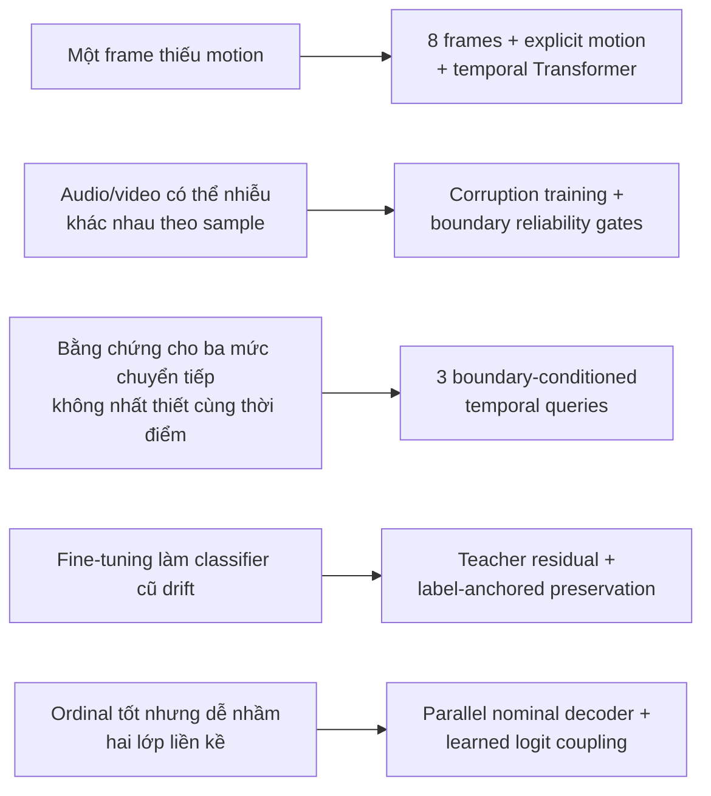

Mô hình vì vậy không phải phép nối feature đơn giản. Nó thực hiện lần lượt:

```text
single-modal representation
→ temporal motion reasoning
→ audio-conditioned event selection
→ boundary-specific evidence extraction
→ reliability-aware multimodal interaction
→ ordinal decoding
→ exact-class correction
→ final four-class log-probability
```

## 15. Các file nguồn tương ứng

- Entry point: [`main.py`](../main.py)
- Config được entry point đọc: [`config/train_config.json`](../config/train_config.json)
- Dataset/collate: [`dataset/multimodal_dataset.py`](../dataset/multimodal_dataset.py)
- Audio loading: [`dataset/audio_loader.py`](../dataset/audio_loader.py)
- Video decoding: [`dataset/video_loader.py`](../dataset/video_loader.py)
- Clip transforms: [`transforms/video_transform.py`](../transforms/video_transform.py)
- Multimodal wrapper và feature hooks: [`models/multimodal_model.py`](../models/multimodal_model.py)
- Audio frontend: [`features/audio_frontend.py`](../features/audio_frontend.py)
- PANNs CNN6: [`models/audio/panns_cnn6.py`](../models/audio/panns_cnn6.py)
- EfficientNet-B0 wrapper: [`models/video/efficientnet_b0.py`](../models/video/efficientnet_b0.py)
- Temporal BORA-Fuse: [`models/fusion/fusion_heads.py`](../models/fusion/fusion_heads.py)
- CORN mapping và toàn bộ BORA loss: [`utils/ordinal.py`](../utils/ordinal.py)
- Corruption: [`utils/corruption.py`](../utils/corruption.py)
- Training/checkpoint/test loop: [`tasks/trainer.py`](../tasks/trainer.py)

</details>
