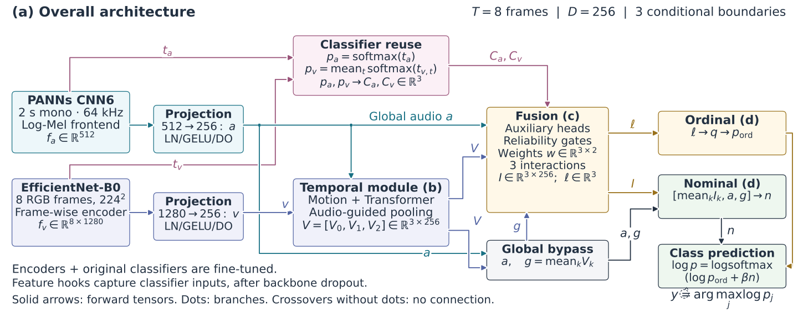
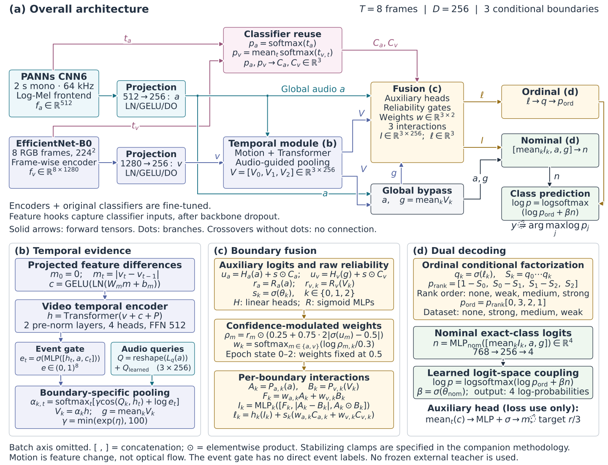

> **Historical note:** this document describes the earlier CORN/ordinal Dual-Decoder Temporal BORA design, which has been removed from the code. The current architecture is described in `docs/temporal_reliability_fusion.md`.

# Methodology figure — Dual-Decoder Temporal BORA-Fuse

Hình này được đối chiếu với đường chạy `main.py` → `config/train_config.json` →
`MultimodalDeepFusionModel.forward()` → `TemporalBORAFusion.forward()` và
`bora_loss()`. Đây là **sơ đồ implementation hiện tại**, không phải kiến trúc đề xuất
thêm hoặc sơ đồ suy ra từ tên model. Không sửa code model để khớp hình.

Đã so sánh AST với notebook đang mở
`D:\Capstone\Multimodal_Deep_Fusion_dual_decoder_effnet.ipynb`: sáu định nghĩa
`PANNS_Cnn6`, `EfficientNetB0`, `MultimodalDeepFusionModel`, `TemporalBORAFusion`,
`conditional_logits_to_rank_probabilities` và `bora_loss` trùng với code module.
Đối chiếu này xác nhận các phần kiến trúc/loss được dùng để dựng hình, không khẳng
định mọi cell hoặc thiết lập môi trường trong notebook đều giống entrypoint.

## 1. Hình chính cho paper

[SVG vector — hình tổng thể](diagrams/paper_methodology_overview.svg) ·
[PNG 300 dpi — hình tổng thể](diagrams/paper_methodology_overview.png)



Đọc từ trái sang phải. Đường hồng là logits từ classifier gốc, **vẫn tham gia
inference**; không phải mũi tên loss. Chấm tròn là nhánh rẽ; hai dây giao nhau mà
không có chấm không nối tensor. Khối “Global bypass” biểu diễn việc tính `g` và
truyền tiếp `a`, không phải một MLP được học mới.

## 2. Bản ghép với các khối phóng chi tiết

[SVG vector — đủ panel (a–d)](diagrams/paper_methodology.svg) ·
[PNG 6000 × 4590 — đủ panel](diagrams/paper_methodology.png) ·
[Source dựng hình](diagrams/render_paper_methodology.py)



Hình dùng nhãn tiếng Anh. Với paper hai cột, đặt hình ở toàn chiều rộng hai cột;
không ép cả bản ghép vào một cột. Ưu tiên SVG để chữ và đường nối không vỡ khi
phóng to. Bản tổng thể và bản ghép được xuất từ cùng một layout, không phải hai
phiên bản kiến trúc khác nhau. Các ô (b–d) dùng lại tensor đã định nghĩa ở (a);
công thức trong ô liệt kê đầu vào, không lặp lại mọi dây nối dài.

Caption tiếng Anh cho bản ghép:

> **Overview of the dual-decoder Temporal BORA-Fuse architecture.** (a) A PANNs
> CNN6 audio encoder and a shared frame-wise EfficientNet-B0 video encoder provide
> projected features and logits from their original, fine-tuned classifiers.
> (b) Projected frame differences augment a video Transformer; global audio
> conditions an event gate and three queries for boundary-specific temporal
> pooling. (c) Confidence-modulated reliability weights control weighted
> modality mixing and classifier-logit residuals. Boundary-specific interactions
> additionally retain absolute-difference and elementwise-product features.
> (d) Three conditional logits define an ordinal distribution, while a nominal
> decoder uses mean boundary evidence and ungated global audio/video features.
> A learned nominal-logit residual corrects the ordinal log-probabilities before
> final normalization. Batch dimensions are omitted. The auxiliary motion head
> contributes supervision but does not feed the class prediction.

Caption ngắn cho hình tổng thể riêng:

> **Overall prediction pipeline of dual-decoder Temporal BORA-Fuse.** Audio-guided
> temporal evidence and reused single-modal classifier decisions feed
> boundary-specific reliability fusion. Ordinal and nominal decoders are coupled
> in logit space; global audio and pooled video features also reach the nominal
> decoder through an ungated bypass. Both single-modal encoders and their original
> classifiers are fine-tuned.

## 3. Ký hiệu và kích thước

Trong hình bỏ trục batch `B`; bảng dưới giữ đầy đủ trục. `LN` = LayerNorm,
`DO` = dropout, `σ` = sigmoid, `[ , ]` = concatenate theo feature dimension,
`⊙` = nhân từng phần tử. Các `Linear`/projection trong công thức bao gồm bias.

| Tensor | Shape hiện tại | Ý nghĩa |
| --- | --- | --- |
| `waveform` | `[B,128000]` | Audio mono, resample 64 kHz, crop/pad 2 s |
| `video_form` | `[B,8,3,224,224]` | 8 frame RGB lấy đều, resize và normalize |
| `f_a`, `t_a` | `[B,512]`, `[B,4]` | Input và output của classifier audio gốc |
| `f_v`, `t_v` | `[B,8,1280]`, `[B,8,4]` | Input và output của classifier từng frame |
| `a` | `[B,256]` | Global audio sau projection |
| `v`, `m`, `c`, `h` | `[B,8,256]` | Projected frames, sai khác, motion context, temporal tokens |
| `e`, `Q`, `α` | `[B,8]`, `[B,3,256]`, `[B,3,8]` | Event gate, queries, temporal attention |
| `V`, `g` | `[B,3,256]`, `[B,256]` | Ba boundary features và trung bình của chúng |
| `C_a`, `C_v`, `u_a`, `u_v` | `[B,3]` | Reused conditional logits và auxiliary logits |
| `r_a`, `r_v`, `ρ_a`, `ρ_v` | `[B,3]` | Raw reliability và confidence-modulated reliability |
| `w` | `[B,3,2]` | Audio/video weights riêng cho từng boundary |
| `I`, `ℓ` | `[B,3,256]`, `[B,3]` | Interaction features và fused conditional logits |
| `p_ord`, `n`, `clipwise_output` | `[B,4]` | Ordinal probabilities, nominal logits, final log-probabilities |
| `motion_score` | `[B]` | Auxiliary estimate được supervise bằng rank/3 |

`T=8`, `D=256`, `k∈{0,1,2}`. Bảng position có sức chứa 16 frame nhưng hiện chỉ lấy
8 vị trí đầu. Ba boundary không phải ba class độc lập: chúng là ba conditional
tasks cho bốn mức `none < weak < medium < strong`.

## 4. Forward pass chính xác

### 4.1. Hai encoder và feature hooks

Audio đi qua STFT (`n_fft=2048`, `hop=1024`, center/reflect), log-Mel 128 bins,
pad hai hàng **ở đầu trục thời gian**, BatchNorm theo mel bins; SpecAugment chỉ
bật khi train. Với 128000 samples, tensor vào CNN6 là `[B,1,128,128]`.
STFT và mel filter weights được đóng băng; không đồng nghĩa toàn audio encoder
bị đóng băng.

CNN6 có bốn `Conv5×5 → BN → ReLU → AvgPool2×2`, channels
`1→64→128→256→512`, dropout 0.2 sau mỗi block. Sau đó mean theo frequency,
`max_time + mean_time`, dropout, `FC512→512 → ReLU → dropout`.
Feature hook lấy input của `fc_audioset`, nên `f_a` nằm **sau dropout cuối**;
`t_a` là output của chính classifier `512→4` đó.

Video reshape thành `[B×8,3,224,224]`, chạy cùng một EfficientNet-B0 trên tất cả
frame, lấy vector sau global average pooling và classifier dropout. Hook lấy
input của classifier Linear `1280→4`. Fusion không nhận spatial feature maps.

Cả hai encoder và classifier gốc load checkpoint single-modal và được fine-tune
vì `freeze=false`. `pretrained=false` ở config không có nghĩa là bỏ checkpoint.
Hình không dùng SwinTiny của file config thay thế.

### 4.2. Motion, temporal encoder và audio-guided attention

Hai projection là `Linear → LN → GELU → Dropout(0.15)`.

$$
m_0=0,\qquad m_t=|v_t-v_{t-1}|,\qquad
c=\operatorname{GELU}(\operatorname{LN}(\operatorname{Linear}_m(m))).
$$

$$
h=\operatorname{Transformer}(v+c+P).
$$

Transformer chỉ self-attend trên **video tokens**: hai pre-norm encoder layers,
bốn attention heads, FFN 512, GELU, dropout 0.15 và final LayerNorm.
`m_0=0` không bảo đảm `c_0=0`, vì motion projection có bias và LayerNorm.

$$
e_t=\sigma(\operatorname{MLP}_{event}([h_t,a,c_t])),\qquad
Q=\operatorname{reshape}(\operatorname{Linear}_q(a))+Q_{learned}.
$$

$$
\alpha_{k,t}=\operatorname{softmax}_{t}\left(
\gamma\langle\operatorname{normalize}(Q_k),\operatorname{normalize}(h_t)\rangle
+\log\max(e_t,10^{-6})\right),\qquad
\gamma=\min(e^{\eta},100).
$$

$$
V_k=\sum_t\alpha_{k,t}h_t,\qquad g=\frac{1}{3}\sum_{k=0}^{2}V_k.
$$

`normalize` dùng `F.normalize` mặc định (`eps=1e-12`). Đây là cosine-based
query pooling, không phải thêm một `MultiheadAttention` cross-modal với K/V
projections riêng. Hình viết `V_k=α_k h` theo phép nhân ma trận tương đương.
Event gate được học gián tiếp từ các loss downstream; không có ground-truth
event mask. Motion là sai khác **sau projection/dropout**, không phải optical flow.

### 4.3. Tái sử dụng logits từ classifier gốc

$$
p_a=\operatorname{softmax}(t_a),\qquad
p_v=\frac{1}{T}\sum_t\operatorname{softmax}(t_{v,t}).
$$

Với mỗi modality, reorder probability từ dataset order `[none,strong,medium,weak]`
sang rank order `[none,weak,medium,strong]`. Gọi vector sau reorder là `p^r`:

$$
d_0=p^r_1+p^r_2+p^r_3,\qquad d_1=p^r_2+p^r_3,\qquad d_2=p^r_3,
$$

$$
C=\operatorname{logit}\!\left(\operatorname{clamp}\left(
\left[d_0,\frac{d_1}{\max(d_0,10^{-6})},\frac{d_2}{\max(d_1,10^{-6})}\right],
10^{-5},1-10^{-5}\right)\right).
$$

Không `detach` classifier logits trên đường này. “Teacher” trong tên biến code
chỉ các classifier gốc đang được tái sử dụng, không phải teacher model ngoài được
đóng băng. Chúng tác động vào cả auxiliary logits lẫn fused ordinal logits.

### 4.4. Reliability và boundary fusion

$$
u_a=H_a(a)+s\odot C_a,\qquad u_v=H_v(g)+s\odot C_v,\qquad
s_k=\sigma(\theta_k).
$$

$$
r_a=R_a(a),\quad r_{v,k}=R_v(V_k),\quad
\rho_m=r_m\odot\left(0.25+0.75\cdot2|\sigma(u_m)-0.5|\right).
$$

`H_a/H_v` là Linear `256→3`; `R_a` là sigmoid MLP `256→256→3`, còn `R_v`
là sigmoid MLP `256→256→1` dùng chung trên ba `V_k`. Vì vậy auxiliary video head
nhận `g`, nhưng video reliability head nhận **từng `V_k`**.

$$
w_{k,:}=\operatorname{softmax}_{m\in\{a,v\}}
\left(\frac{\log\max(\rho_{m,k},10^{-6})}{0.3}\right).
$$

`set_epoch(epoch)` với `epoch∈{0,1,2}` override `w_a=w_v=0.5`. Cờ này phụ thuộc
**epoch được truyền vào, không phụ thuộc `model.training`**. Trainer truyền epoch
hiện tại cho cả train và validation; khi test lại truyền epoch của best checkpoint.
Vì vậy validation ba epoch đầu cũng dùng gate 0.5; nếu best checkpoint nằm trong
ba epoch này thì test trong `main.py` cũng dùng gate 0.5. `set_epoch(None)` mới tắt
warmup vô điều kiện; `model.eval()` một mình không reset cờ. Hình ghi “Epoch state”
để không mô tả sai đây là cơ chế chỉ hoạt động trong train mode.

Với từng `k`, có projections, interaction MLP và scalar classifier riêng:

$$
A_k=P_{a,k}(a),\quad B_k=P_{v,k}(V_k),\quad
F_k=w_{a,k}A_k+w_{v,k}B_k,
$$

$$
I_k=\operatorname{MLP}_k([F_k,|A_k-B_k|,A_k\odot B_k]),
$$

$$
\ell_k=h_k(I_k)+s_k(w_{a,k}C_{a,k}+w_{v,k}C_{v,k}).
$$

`P` là Linear `256→256`; interaction MLP là `Linear768→256 → LN → GELU → DO`;
`h_k` là Linear `256→1`. **Cùng ba scale `s_k`** được dùng cho auxiliary residual
và fused residual. Teacher residual cộng vào scalar logits **sau** interaction;
không cộng trực tiếp vào `I_k`.

### 4.5. Hai decoder và output

$$
q_k=\sigma(\ell_k),\qquad S_k=\prod_{j=0}^{k}q_j,
$$

$$
p_{rank}=[1-S_0,S_0-S_1,S_1-S_2,S_2],\qquad
p_{ord}=p_{rank}[0,3,2,1].
$$

Code clamp `p_rank` tối thiểu 0 trước reorder. Nominal branch:

$$
n=\operatorname{MLP}_{nom}\left(\left[\frac{1}{3}\sum_k I_k,a,g\right]\right),
\qquad \operatorname{MLP}_{nom}:768\rightarrow256\rightarrow4.
$$

Hidden block của nominal head là `Linear → LN → GELU → DO(0.15)`; layer cuối
là Linear. Đây là **mean của ba `I_k`, rồi concat với `a,g`**, không phải concat
cả ba `I_k` thành 768 chiều.

$$
\log p=\operatorname{logsoftmax}\left(\log\max(p_{ord},10^{-8})+\beta n\right),
\qquad\beta=\sigma(\theta_{nom}),\qquad\hat y=\arg\max_j\log p_j.
$$

Output `clipwise_output` là **log-probabilities**, dataset order
`0=none, 1=strong, 2=medium, 3=weak`. `rank_probabilities` trong output dict là
phân phối ordinal **trước** nominal correction, không phải final prediction.
Đường chạy này không dùng `fit_ordinal_thresholds()` để quyết định class.
Các `θ_k` và `θ_nom` khởi tạo `-1.1`, nên scale sigmoid ban đầu xấp xỉ `0.2497`.

## 5. Training objective — tách khỏi prediction graph

Gọi `y` là dataset label, `r=[0,3,2,1][y]` là ordinal rank. Conditional target
và mask là `b_k=1[r>k]`, `M_k=1[r≥k]`.

$$
\begin{aligned}
\mathcal L={}&\mathcal L_{CORN}(\ell,r)
+0.3\left[\mathcal L_{CORN}(u_a,r)+\mathcal L_{CORN}(u_v,r)\right]\\
&+0.1\mathcal L_{rel}+1.0\mathcal L_{NLL}(\log p,y)
+0.1\mathcal L_{motion}+0.5\mathcal L_{CE}(n,y)
+0.3\mathcal L_{preserve}.
\end{aligned}
$$

- `CORN` = mean BCEWithLogits trên **tất cả phần tử active** của batch và ba tasks.
- `L_rel` = trung bình hai modality của masked SmoothL1 giữa **raw** `r_m` và
  `exp(-BCEWithLogits(u_m,b)).detach()`. Không supervise trực tiếp `w` hay `ρ`.
- `motion_score = sigmoid(MLP(mean_t(c)))`; `L_motion = SmoothL1(motion_score,r/3)`.
  Head này vẫn được tính trong `forward()` khi eval, nhưng không truyền vào class
  prediction. “Loss use only” trong hình nói về vai trò, không phải conditional
  execution chỉ khi `self.training=True`.
- `L_preserve = 0.5[CE(t_a,y)+CE(mean_t(t_v),y)]`. Lưu ý preservation dùng
  **mean logits**, còn classifier reuse dùng **mean probabilities**. Đây là
  label-anchored CE, không phải KL distillation.
- Training có input corruption/modality dropout trước model và SpecAugment trong
  audio frontend; không vẽ chúng như module inference.
- Config hiện tại: Adam, fusion LR `1e-4`, encoder/classifier LR `1e-5`, tối đa
  120 epochs; chọn checkpoint theo validation accuracy. Đây là thiết lập thí
  nghiệm, không phải các tầng trong forward graph.

## 6. Cách giải thích methodology mà không vượt quá điều code chứng minh

| Khối | Vai trò kiến trúc | Không nên khẳng định chỉ từ code |
| --- | --- | --- |
| CNN6 / EfficientNet-B0 | Trích đặc trưng âm thanh toàn clip và ảnh từng frame; tái sử dụng checkpoint | Backbone hoặc model này tốt nhất nếu chưa có so sánh |
| Motion + Transformer | Đưa sai khác feature và ngữ cảnh thời gian vào video tokens | Đây là optical flow; motion chỉ phản ánh chuyển động vật lý |
| Event gate + queries | Audio điều kiện hóa trọng số chọn frame riêng cho ba boundary | Gate đã được supervise/hiệu chuẩn để phát hiện feeding event |
| Reliability + confidence | Điều chỉnh weighted sum và teacher residual theo modality/boundary | Gate thấp loại bỏ hoàn toàn modality |
| Difference / product interactions | Giữ cả sai khác và đồng kích hoạt feature | Tất cả evidence đều đi qua reliability gate: hai thành phần này không được nhân `w` |
| Ordinal branch | Factorize bốn mức thành ba conditional tasks | Final classifier dùng ba ngưỡng độc lập; output chắc chắn đơn điệu theo mức motion input |
| Nominal branch + bypass | Học exact-class logits từ pooled interactions và `a,g` không gated | Hai decoder là ensemble lấy trung bình xác suất |
| Classifier reuse + preservation | Duy trì và tái sử dụng decision signal từ head gốc khi fine-tune | Có frozen teacher, KL distillation, hoặc bảo đảm không bị drift |

Các giải thích về lợi ích là **rationale thiết kế**; hiệu quả cần kiểm chứng bằng
ablation và dữ liệu thực nghiệm, không suy ra từ sơ đồ.

## 7. Nguồn code và tái tạo hình

| Nội dung | Nguồn cần đối chiếu |
| --- | --- |
| Entrypoint và cấu hình thực chạy | [main.py](../main.py), [train_config.json](../config/train_config.json) |
| Audio/video preprocessing | [audio_loader.py](../dataset/audio_loader.py), [video_loader.py](../dataset/video_loader.py), [AudioFrontend](../features/audio_frontend.py) |
| Hai backbone | [panns_cnn6.py](../models/audio/panns_cnn6.py), [efficientnet_b0.py](../models/video/efficientnet_b0.py) |
| Feature hooks, checkpoint load, frame flatten | [multimodal_model.py](../models/multimodal_model.py): `FeatureHook`, `MultimodalDeepFusionModel.forward` |
| Các panel (b–d), residuals, motion head | [fusion_heads.py](../models/fusion/fusion_heads.py): `TemporalBORAFusion.__init__`, `_gate_weights`, `_teacher_probabilities_to_conditional_logits`, `forward` |
| Class order, CORN, objective | [ordinal.py](../utils/ordinal.py): `conditional_logits_to_rank_probabilities`, `rank_probabilities_to_dataset_order`, `bora_loss` |
| Prediction, warmup state, training call | [trainer.py](../tasks/trainer.py): `_run_epoch` |

Tái tạo tất cả SVG/PNG bằng Matplotlib:

```powershell
python docs/diagrams/render_paper_methodology.py
```

Script kiểm tra bounding box của chữ trong node và mọi label so với canvas trước
khi export. Đây là kiểm tra layout; tính đúng kiến trúc phải được đối chiếu với
code như trên. Khi thay config hoặc `forward()`, cần cập nhật cả hình và công thức.
